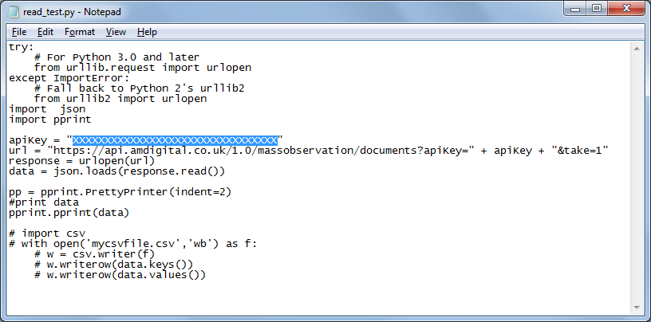
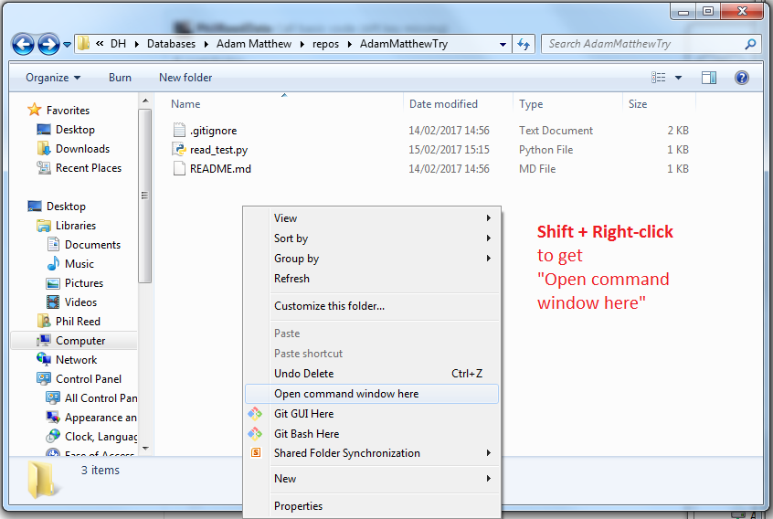
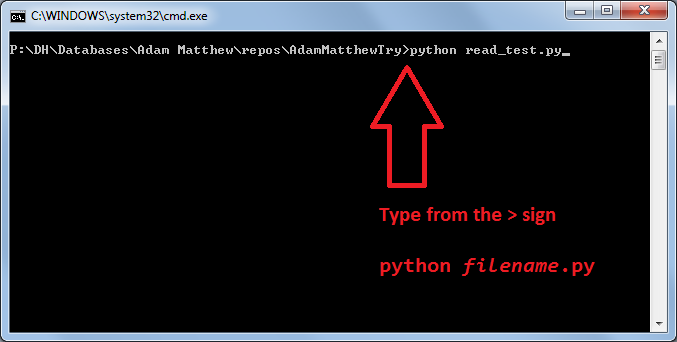

# AdamMatthewTry
Try using the API for data mining with Adam Matthew Digital databases (requires subscription to AM Digital)

First attempt will use Python.

## Requires
- A subscription to Adam Matthew Digital products such as Mass Observation
- An API key for their data mining features

## To run:

- Download these files to your computer.
- Edit `read_test.py` and __replace the `apiKey` value__ from `XXXXXXXXXXXXXXXXXXXXXXXXXXXXXXXX` to the correct value.
- If you are familiar with using the command line, change to this directory and call `python read_test.py`
- If not, and you are using Windows:

Open Explorer at the __AdamMatthewTry__ directory.

In the white space in the middle of the window (below the list of file names), hold Shift and right-click, choose __Open command window here__.

In the command window, type `python read_test.py` and press Enter.

The returned JSON code will show in the command window. There will be a `u` character before each string (piece of text), meaning that the text is Unicode not ASCII -- this will become important later.

## Going further
- You can edit the URL as per the [Adam Matthew API documentation](http://developers.amdigital.co.uk/API/Overview).
- You can find better ways to use the reponses, such as exporting to CSV. You can do this by commenting the last five lines in the script, beginning with the `#` symbol (from `import csv` onwards).